# Plots_Hadronic_VBS
Plots related with VBS VVJJ in Hadronic Final State

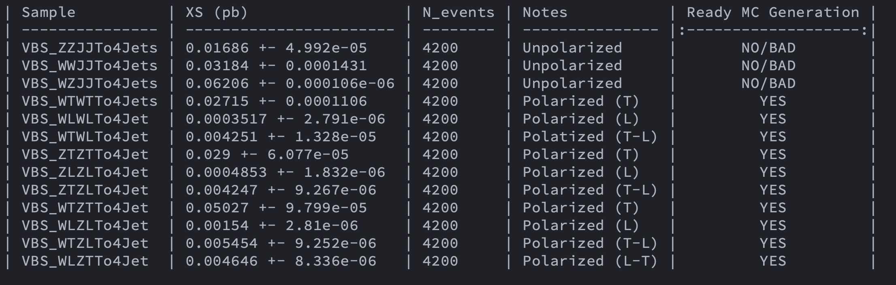

## Plots VBS VBS WW Hadronic (Polarized) 

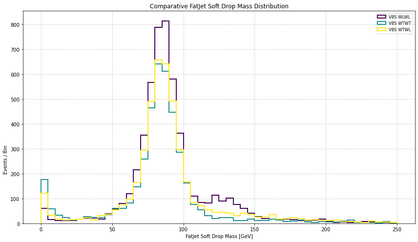

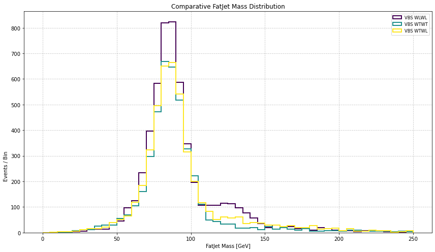

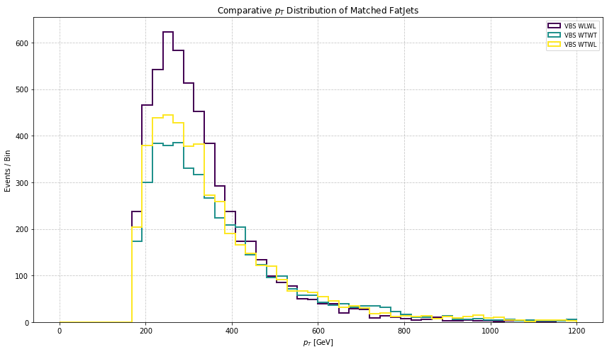

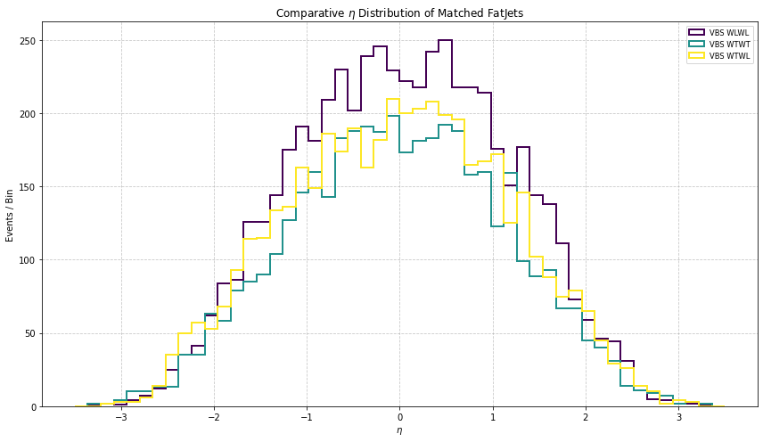

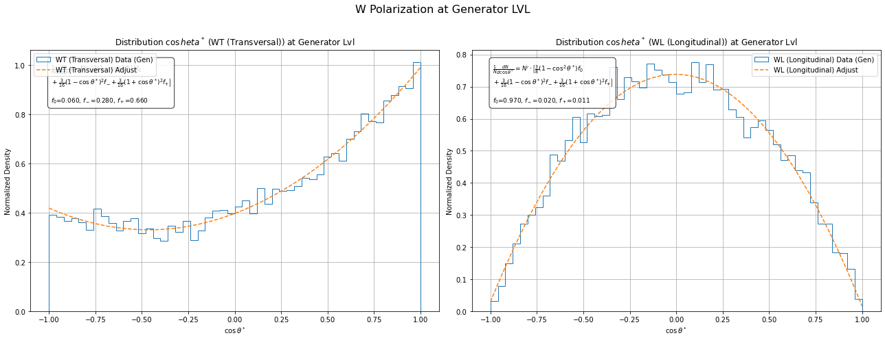

## Plots VBS VBS ZZ Hadronic (Polarized) 

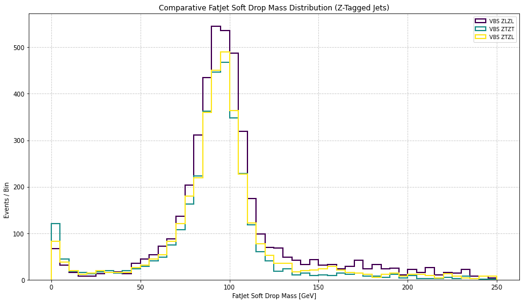

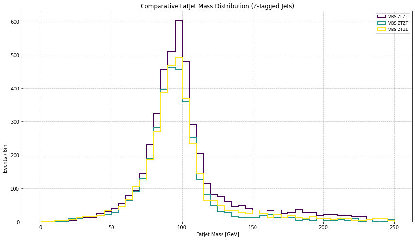

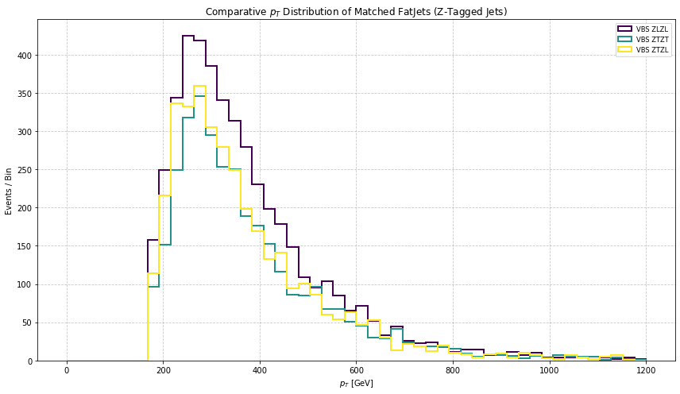

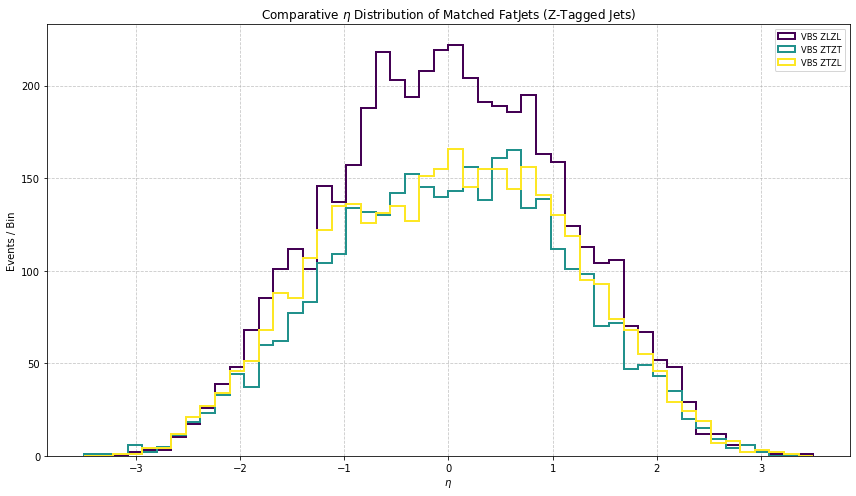

## Plots VBS VBS WZ Hadronic (Polarized) 

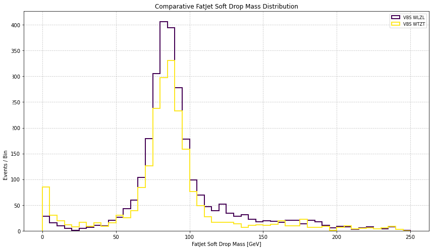

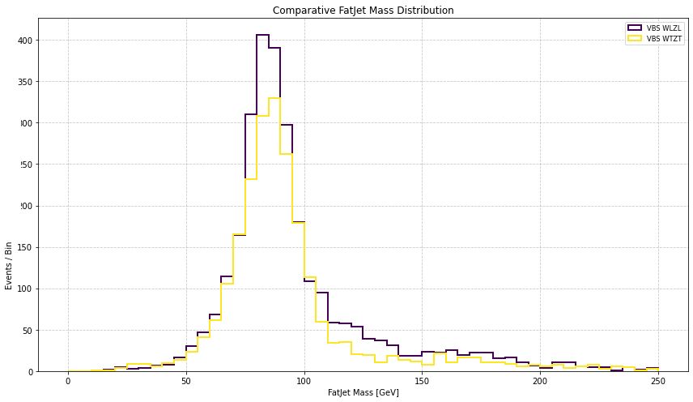

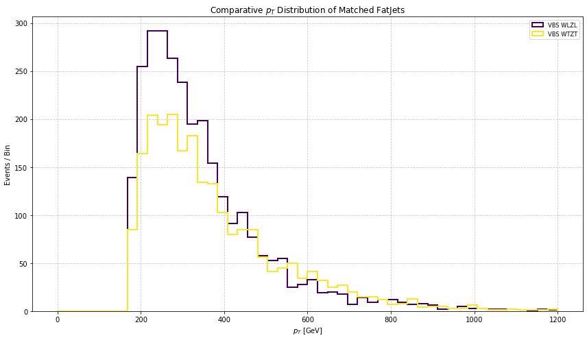

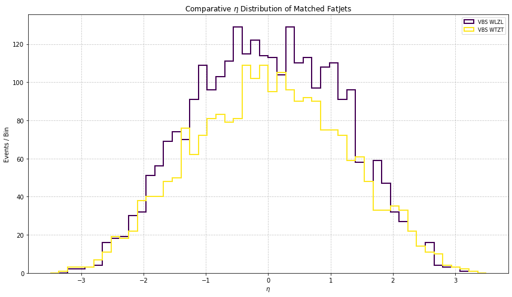
